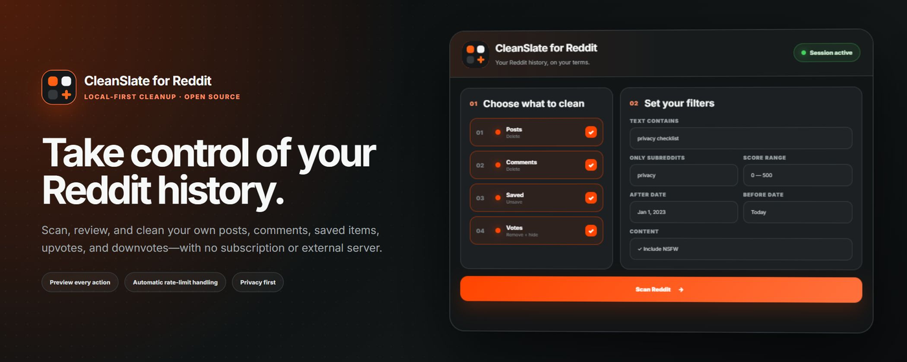

# CleanSlate for Reddit



CleanSlate — бесплатное open-source расширение Manifest V3 для приватной очистки истории Reddit. Оно работает через уже открытую в браузере сессию Reddit: без Client ID, OAuth-формы, внешнего сервера, подписки и аналитики.

[GitHub-репозиторий](https://github.com/Rianvy/CleanSlate-for-Reddit) · [Сообщить о проблеме](https://github.com/Rianvy/CleanSlate-for-Reddit/issues) · [Лицензия MIT](./LICENSE)

## Возможности

- Сканирование собственных постов и комментариев.
- Сканирование сохранённых публикаций, лайков и дизлайков.
- Полная курсорная пагинация Reddit: по 100 элементов на запрос, до 2000 элементов в каждом разделе.
- Фильтры по тексту, сабреддитам, рейтингу, дате и NSFW.
- Предварительный просмотр каждого действия и ручное снятие выбора.
- Удаление собственных постов и комментариев.
- Опциональная перезапись комментария перед удалением.
- Удаление публикаций из сохранённого.
- Снятие лайков и дизлайков.
- Опциональное скрытие поста штатной командой Reddit после снятия голоса.
- Пауза, продолжение, остановка и повтор неудачных действий.
- Автоматическая пауза с обратным отсчётом при достижении лимита Reddit.
- Экспорт предварительного списка в JSON или CSV.
- Русский и английский интерфейс.
- Современная тёмная тема в цветах Reddit, центрированное рабочее окно и launcher в правом нижнем углу.

## Скрытие после снятия голоса

Если включена настройка «Скрывать посты после снятия голоса», CleanSlate выполняет две последовательные операции:

1. Снимает лайк или дизлайк через `/api/vote` с `dir=0`.
2. Скрывает пост через `/api/hide` на `old.reddit.com`. Legacy-origin используется потому, что современный контур Reddit периодически возвращает `400` или не обновляет состояние скрытых публикаций.

Reddit поддерживает действие «Скрыть» только для публикаций (`t3`). Для комментариев (`t1`) CleanSlate корректно снимает голос, но не отправляет неподдерживаемую команду скрытия.

## Как работает сканирование

CleanSlate получает имя текущего пользователя через `/api/me.json`, после чего обходит выбранные разделы:

- `/user/{name}/submitted.json`
- `/user/{name}/comments.json`
- `/user/{name}/saved.json`
- `/user/{name}/upvoted.json`
- `/user/{name}/downvoted.json`

Каждая страница запрашивается с `limit=100`. Расширение следует курсору `after`, пока Reddit не вернёт пустой курсор или не будет достигнут внутренний предел в 2000 элементов. Между страницами выдерживается небольшая пауза, чтобы не создавать лишнюю нагрузку.

Фильтры применяются после получения списка. NSFW включён по умолчанию, поэтому пустые фильтры не уменьшают фактическое количество найденных элементов.

Reddit может самостоятельно ограничивать глубину пользовательских списков. CleanSlate не может получить элементы, которые Reddit перестал выдавать через собственный JSON API.

## Безопасное выполнение очереди

Перед запуском CleanSlate один раз получает сессию и `modhash`, а затем использует их для всей очереди. Расширение не запрашивает `/api/me.json` перед каждым действием.

- Интервал между действиями: от 1,2 до 1,8 секунды.
- После каждых 50 действий: пауза 5 секунд.
- При ответе `429` показывается предупреждение и обратный отсчёт. Вся очередь ждёт разрешённого Reddit времени, затем автоматически повторяет текущий элемент без записи ложной ошибки.
- Для временной ошибки `503` применяется ограниченный повтор с увеличивающейся задержкой.
- Успешные и неудачные элементы учитываются отдельно.
- Повтор ошибок создаёт новую очередь только из неудачных элементов.

## Установка в Chrome, Edge или Chromium

1. Выполните production-сборку:

   ```powershell
   npm install
   npm run build
   ```

2. Откройте страницу расширений:

   - Chrome: `chrome://extensions`
   - Edge: `edge://extensions`

3. Включите «Режим разработчика».
4. Нажмите «Загрузить распакованное расширение».
5. Выберите папку `.output/chrome-mv3` или подготовленную папку `READY-CHROME`.
6. Откройте Reddit и войдите в аккаунт.

После обновления файлов нажмите «Обновить» на карточке расширения и перезагрузите вкладку Reddit через `Ctrl+Shift+R`. Уже открытая вкладка продолжает использовать старый content script до полной перезагрузки страницы.

## Использование

1. Откройте Reddit в авторизованной вкладке.
2. Нажмите кнопку `CleanSlate` в правом нижнем углу.
3. Выберите разделы истории.
4. При необходимости настройте фильтры.
5. Запустите сканирование.
6. Проверьте найденные элементы и снимите выбор с тех, которые нужно оставить.
7. Настройте перезапись комментариев и скрытие постов после снятия голосов.
8. Для удаления постов или комментариев введите `DELETE`.
9. Запустите очередь и дождитесь завершения.

Удалённые посты и комментарии восстановить невозможно. Экспортируйте предварительный список перед большим запуском, если нужен локальный журнал.

## Разрешения

Manifest запрашивает только доступ к `https://*.reddit.com/*` — для чтения выбранных списков и выполнения подтверждённых пользователем действий на Reddit.

Разрешения `identity`, `tabs`, `cookies`, внешний backend и OAuth-конфигурация не используются.

## Приватность

- Учётные данные Reddit не читаются и не сохраняются расширением.
- Используется существующая cookie-сессия браузера с `credentials: include`.
- Данные предварительного просмотра хранятся в памяти вкладки.
- Данные отправляются только на домены Reddit.
- Аналитики, рекламы, лицензирования, платежей и телеметрии нет.
- JSON и CSV создаются только по явной команде пользователя.

Дополнительные сведения находятся в [PRIVACY.md](./PRIVACY.md).

## Открытый исходный код

Проект опубликован на [GitHub](https://github.com/Rianvy/CleanSlate-for-Reddit) и распространяется по лицензии [MIT](./LICENSE): исходный код можно изучать, изменять и распространять на условиях лицензии. Ошибки и предложения принимаются через [GitHub Issues](https://github.com/Rianvy/CleanSlate-for-Reddit/issues).

## Технологии

- WXT 0.21
- React 19
- TypeScript 6
- Vite 8
- Vitest 4
- Manifest V3
- Shadow DOM для изоляции интерфейса от стилей Reddit

## Структура проекта

```text
entrypoints/
  popup/                 всплывающее окно расширения
  reddit.content/        интерфейс, внедряемый на страницы Reddit
src/
  CleanerApp.tsx         состояния и экраны CleanSlate
  session-client.ts      сессия, сканирование и Reddit API actions
  action-queue.ts        очередь, пауза, повтор и rate limiting
  filters.ts             фильтрация и дедупликация
  domain.ts              типы предметной области
  i18n.ts                русский и английский интерфейс
tests/                   регрессионные тесты
public/                  локализации и иконки
```

## Разработка

```powershell
npm install
npm run dev
```

Firefox development mode:

```powershell
npm run dev:firefox
```

## Проверки и сборка

```powershell
npm run typecheck
npm run lint
npm test
npm run build
```

Chromium-сборка создаётся в `.output/chrome-mv3`. Сборка Firefox создаётся командой:

```powershell
npm run build:firefox
```

## Reddit API actions

| Выбранный раздел | Действие CleanSlate | Reddit endpoint |
|---|---|---|
| Посты | Удаление | `/api/del` |
| Комментарии | Перезапись, затем удаление | `/api/editusertext`, `/api/del` |
| Сохранённое | Удаление из сохранённого | `/api/unsave` |
| Лайки и дизлайки | Снятие голоса | `/api/vote`, `dir=0` |
| Лайки и дизлайки, если выбран пост | Опциональное скрытие | `/api/hide` |

Все изменяющие операции запускаются только после предварительного просмотра и явного подтверждения пользователя.

## Поддержать проект

Если расширение вам нравится — можно поддержать разработку:

| Способ | Ссылка |
|--------|--------|
| 🇷🇺 Visa, MasterCard, МИР | [Cloudtips](https://pay.cloudtips.ru/p/b59e1765) |
| 🌍 Зарубежные карты и крипта | [Tribute](https://t.me/tribute/app?startapp=dE4k) |
